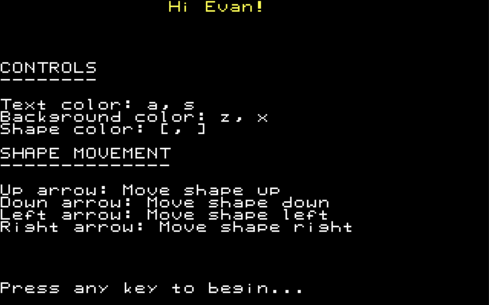
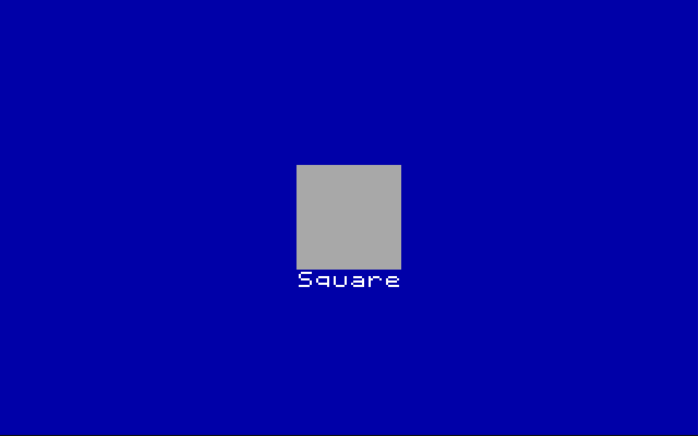
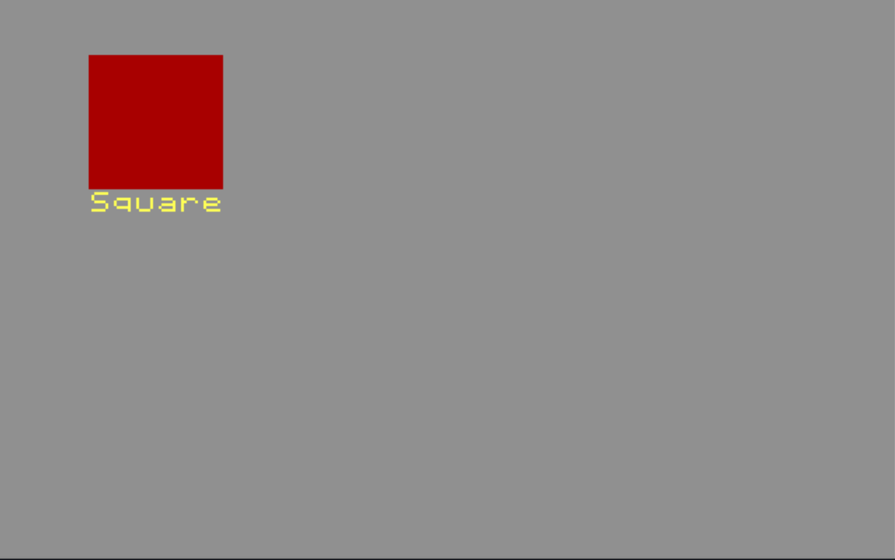

# learncolors

An unfinished 320x200 VGA mode 16-bit program written in pure 8086 assembly to teach my son about colors and shapes. The character set in use here was painstakingly created from scratch over the course of a couple hours.

This code is in the public domain. If something I've done here makes it easier to write your own program then by all means go ahead and use it.

## Screenshots

